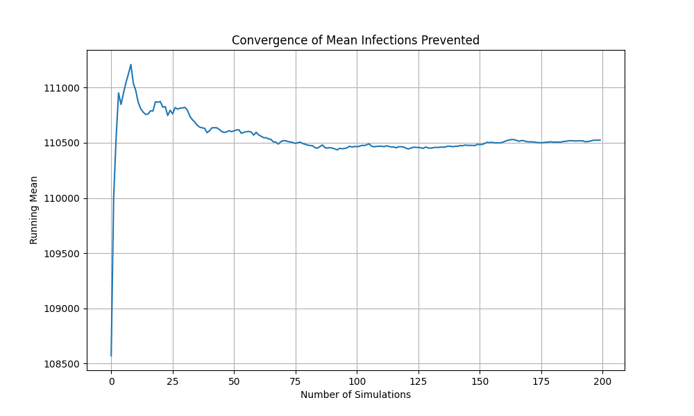
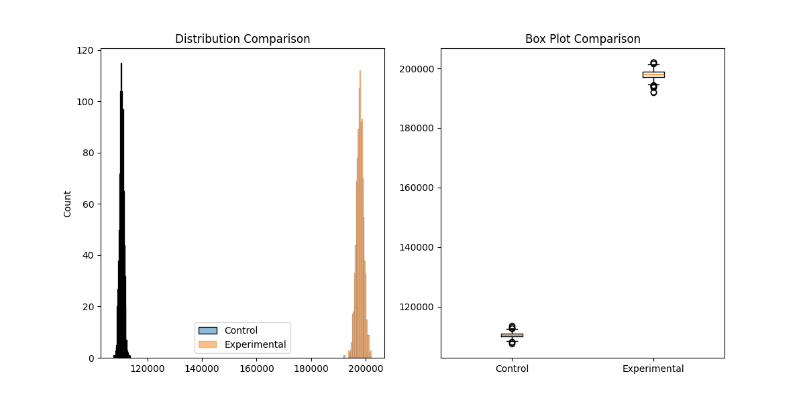

# **Optimizing Vaccine Distribution Strategies Using Monte Carlo Simulation**
## Overview
This project aims to optimize vaccine distribution strategies during pandemics by utilizing Monte Carlo simulation techniques. Through iterative simulations, it evaluates the impacts of varying vaccine efficacy and availability on infection prevention, providing critical insights for effective public health decision-making.

## Key Features
- **Dynamic Simulation:** Models regional variations in population, infection rates, vaccine availability, and efficacy.
- **Scenario Comparison:** Analyzes the effects of isolated and combined improvements in vaccine parameters.
- **Uncertainty Modeling:** Integrates real-world variability through random adjustments to infection rates.
- **Result Validation:** Ensures statistical robustness of outputs via convergence testing.
- **Visualization:** Generates clear visual summaries for decision-making, including histograms, convergence plots, and comparison charts.

## Project Directory Structure
    monte_carlo_vaccine_sim/
    ├── data/                      
    │   ├── population_data.csv    # Population demographics by region
    │   ├── infection_rates.csv    # Regional infection rate data
    │   └── vaccine_params.csv     # Vaccine parameters configuration
    ├── src/                       
    │   ├── __init__.py           # Package initialization
    │   ├── simulation.py         # Core VaccineSimulation class
    │   └── utils.py             # Data loading utilities
    └── run_experiments.py        # Main experiment runner

## How It Works
### Step 1. Initialization
   The simulation initializes with:
   - **Population data:** Region-specific population sizes and infection rates.   
   - **Infection rates:** Region-specific infection rates
   - **Vaccine parameters:** Availability and efficacy values.
### Step 2. Simulation Process    
   1. **Data Validation:** Ensures all input data meets required format and value ranges
   2. **Simulation Validation:** Performs convergence testing with multiple iterations
   3. **Vaccine Allocation:** Distributes vaccines based on infection rates and availability
   4. **Impact Calculation:** Computes prevented infections using:
     - Effective Vaccines = Vaccines Allocated × Vaccine Efficacy
     - Infections Prevented = Effective Vaccines × Infection Rate
### Step 3. Experimentation
Three scenarios are evaluated:
1. Increased Efficacy: Testing 20% improvement in vaccine efficacy
2. Increased Availability: Testing 50% improvement in vaccine availability
3. Combined Improvement: Testing both improvements simultaneously
### Step 4. Validation
The simulation runs multiple iterations to ensure statistical robustness, validated through metrics like mean, standard deviation, and coefficient of variation.    

### Step 5. Statistical Analysis
- Performs t-tests to determine statistical significance
- Generates visualizations for result interpretation
- Calculates key metrics including mean prevention rates and improvements

## Results
1. **Vaccine Efficacy:** A 20% increase resulted in significant reductions in infections.
2. **Vaccine Availability:** A 50% increase had an even greater impact.
3. **Combined Strategy:** Improved efficacy and availability together reduced infections by nearly 80%, the most effective approach.

## Visualization



## Future Enhancements
**Logistic Integration:** Add vaccine transportation, storage, and distribution constraints.    
**Real-World Constraints:** Incorporate infrastructure delays, labor shortages, and unexpected disruptions. 
**Broader Applications:** Extend the model to other public health interventions, such as medication distribution or outbreak management.

## Usage
1. Ensure required data files are in the data/ directory
2. Run experiments:
   
```bash

python run_experiments.py

```

## Requirements
- Python 3.x
- pandas
- numpy
- matplotlib
- seaborn
- scipy
